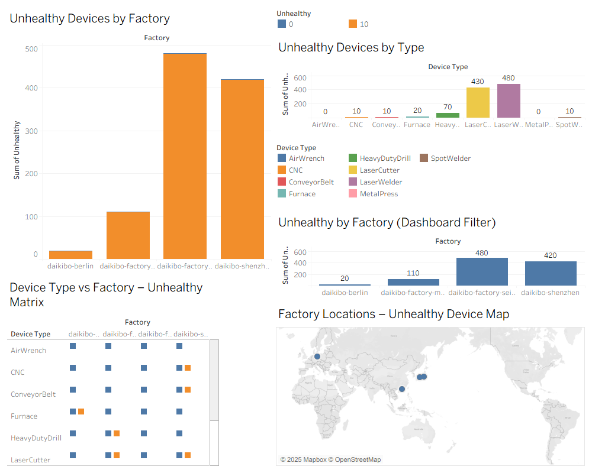
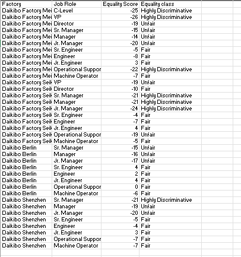

# Deloitte Australia Data Analytics Simulation (August 2025)

This repository showcases my completed work for the **Deloitte Australia Data Analytics Virtual Job Simulation** hosted on Forage.  
The project involved working with real-world style datasets, performing analytical tasks in Excel, and building a professional dashboard in Tableau to deliver clear, actionable insights.

---

## 📂 Contents

- **`Deloitte_Analytics_Dashboard.twbx`** – Interactive Tableau Packaged Workbook with factory analysis, device type breakdown, geographic mapping, and integrated KPI filters.
- **`Equality_Table_Completed.xlsx`** – Processed Excel file classifying Equality Scores into Fair, Unfair, and Highly Discriminative categories using automated formulas.

---

## 🛠 Tools & Skills Demonstrated

| Tool / Skill       | Application                                                                 |
|--------------------|-----------------------------------------------------------------------------|
| **Tableau**        | Built an interactive multi-view dashboard with filters and calculated fields |
| **Excel**          | Automated classification using conditional formulas and cleaned datasets    |
| **Data Cleaning**  | Removed inconsistencies, organized data for analysis                        |
| **Data Visualization** | Designed clear, interactive charts and maps for stakeholder insights     |
| **Analytical Thinking** | Identified trends, patterns, and actionable insights from raw datasets  |

---

## 📊 Project Overview

### **Task 1 — Data Analysis & Dashboard Creation**
- Designed a Tableau dashboard integrating four views:
  1. Factory vs. Unhealthy Device Counts  
  2. Device Type vs. Unhealthy Counts  
  3. Factory distribution by color-coded KPI  
  4. Geographic map showing production sites with KPI indicators
- Implemented dashboard-level filters so selecting one element updates all charts simultaneously.

**Dashboard Preview:**

---

### **Task 2 — Forensic Technology Equality Classification**
- Worked with a dataset containing **Factory**, **Job Role**, and **Equality Score**.
- Created a 4th column (**Equality Class**) using Excel formulas to categorize scores into Fair, Unfair, and Highly Discriminative.
- Applied auto-fill techniques to classify the entire dataset efficiently and accurately.

**Excel Classification Preview:**

---

## 📌 Key Insights
- Certain factories had significantly higher **unhealthy device counts** compared to others.  
- Patterns in equality scores revealed potential **gender pay discrepancies** in specific job roles.  
- Geographic mapping pinpointed locations contributing most to inequality and device issues.  
- Created a **single dashboard view** enabling stakeholders to interactively explore all metrics.

---

## 🚀 Outcome
This simulation strengthened my capabilities in:
- Business-focused data analysis
- Best practices in data visualization using Tableau
- Logical classification and automation in Excel
- Translating raw data into actionable business insights

---

## 🔗 How to View
1. **Tableau Dashboard**  
   - Download `Deloitte_Analytics_Dashboard.twbx` from this repository.
   - Open in **Tableau Desktop** or **Tableau Public** (free).

2. **Excel Classification File**  
   - Open `Equality_Table_Completed.xlsx` in Excel to view formulas and categorized data.

---

## 📬 Contact
If you’d like to discuss this project or collaborate on data analytics work:  
**LinkedIn:** (https://www.linkedin.com/in/vk18phoenix/)  
**GitHub:** (https://github.com/Vk18phoenix)  
**Email:** vkalyan782@gmail.com
